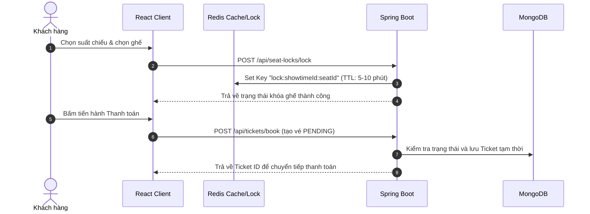
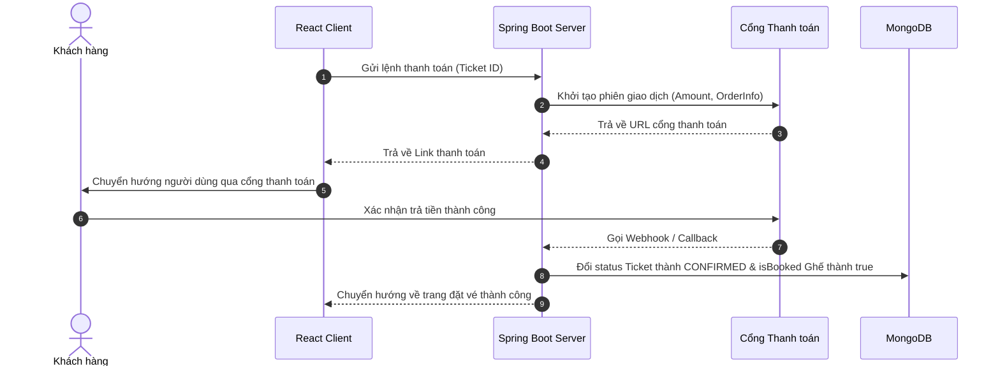
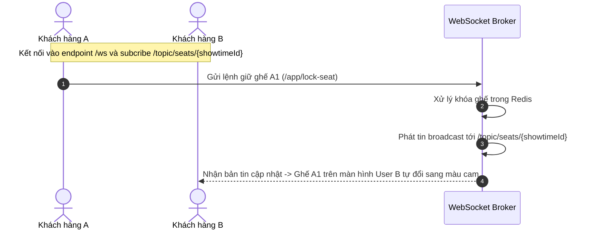

## 1. Công Nghệ & Thư Viện Sử Dụng (Tech Stack)

### Backend (Spring Boot Ecosystem)
| Công Nghệ | Thư Viện / Giải Pháp | Chức Năng |
| :--- | :--- | :--- |
| **Bảo mật & Xác thực** | `Spring Security`, `JWT` | Bảo mật endpoints, phân quyền vai trò (Admin, User). |
| **Đăng nhập Mạng xã hội** | `Google API Client`, `RestFB` | Đăng nhập nhanh qua tài khoản Google và Facebook. |
| **Database & Cache** | `MongoDB`, `Redis Cache` | Lưu trữ dữ liệu chính NoSQL kết hợp bộ nhớ đệm hiệu năng cao. |
| **Real-time Engine** | `Spring WebSocket` | Kết nối socket hai chiều phục vụ cập nhật trạng thái giữ ghế ảo. |
| **Thanh toán trực tuyến** | `Stripe SDK`, `Momo API`, `ZaloPay API` | Xử lý giao dịch đặt vé qua thẻ quốc tế và ví điện tử. |
| **Tiện ích hệ thống** | `Spring Mail`, `Lombok` | Gửi email xác nhận kèm mã QR code trực quan và giảm boilerplate code. |

### Frontend (React Ecosystem)
| Công Nghệ | Thư Viện / Giải Pháp | Chức Năng |
| :--- | :--- | :--- |
| **Real-time Client** | `@stomp/stompjs`, `sockjs-client` | Đồng bộ trạng thái ghế và phòng vé thời gian thực. |
| **3D Animation** | `Three.js` | Tạo hiệu ứng mở màn chiếu 3D chân thực khi chọn ghế. |
| **Hiệu ứng & Motion** | `Framer Motion` | Xử lý chuyển trang và hiển thị modal mượt mà. |
| **Biểu đồ & Dashboard** | `Chart.js`, `React Chartjs 2` | Hiển thị biểu đồ báo cáo doanh thu trên trang Admin. |
| **AI & Nhận diện** | `Face-api.js` | Đăng nhập và xác thực bằng nhận diện khuôn mặt (FaceID). |
| **Đa ngôn ngữ (i18n)** | `i18next`, `react-i18next` | Chuyển đổi ngôn ngữ giao diện Anh / Việt. |
| **HTTP Client** | `Axios` | Kết nối và tương tác với các REST API. |

---

## 2. Hướng Dẫn Khởi Chạy Dự Án (How to run project)

### Khởi chạy Backend (Spring Boot Server)
1. Mở thư mục `spring_boot_server/Server`.
2. Đảm bảo dịch vụ **MongoDB** (cổng `27017`) và **Redis** (cổng `6379`) đang hoạt động.
3. Cấu hình các thông số kết nối trong file `src/main/resources/application.properties`.
4. Chạy lệnh:
   ```bash
   ./mvnw spring-boot:run
   ```
   *Backend API sẽ chạy tại: `http://localhost:8080`*

### Khởi chạy Frontend (React + Vite)
1. Mở thư mục `frontend`.
2. Cài đặt các thư viện:
   ```bash
   npm install
   ```
3. Khởi chạy môi trường phát triển:
   ```bash
   npm run dev
   ```
   *Frontend sẽ khả dụng tại: `http://localhost:5173`*

---

## 3. Cài Đặt Tài Khoản Admin (Admin Account Setup)

Đăng ký tài khoản Admin thông qua một khóa bảo mật hệ thống (`adminKey`):

*   **Endpoint:** `POST /api/admin/register`
*   **Body:**
    ```json
    {
      "username": "admin_hak",
      "password": "SecurePassword123",
      "email": "admin@hakcinema.com",
      "adminKey": "HAK_SECRET_ADMIN_KEY_2026"
    }
    ```
*(Lưu ý: Giá trị `adminKey` mặc định được quy định trong mã nguồn backend `AdminAuthService.java`)*

---

## 4. Thiết Kế Cơ Sở Dữ Liệu (Database Schema)

Hệ thống lưu trữ trên MongoDB với các Collection chính sau:

### Users (`users`)
Lưu trữ thông tin tài khoản và sinh trắc học FaceID:
```json
{
  "_id": "ObjectId",
  "username": "String (Unique)",
  "password": "String (Bcrypt Hashed)",
  "email": "String (Unique)",
  "role": "String (ROLE_USER, ROLE_ADMIN)",
  "faceDescriptor": "Array (Float)",
  "createdAt": "Date"
}
```

### Tickets (`tickets`)
Thông tin chi tiết vé xem phim và thanh toán:
```json
{
  "_id": "ObjectId",
  "userId": "String (Indexed)",
  "showtimeId": "String (Indexed)",
  "movieId": "String",
  "movieTitle": "String",
  "seatNumber": "String (Ví dụ: A1, A2)",
  "price": "Double",
  "status": "String (pending, confirmed, cancelled, used)",
  "paymentStatus": "String (pending, paid)",
  "paymentMethod": "String (Stripe, MoMo, ZaloPay, VietQR)",
  "qrCode": "String (Chứa mã QR code gửi mail)",
  "ticketNumber": "String",
  "bookingTime": "String"
}
```

### Seats (`seats`)
Trạng thái đặt và khóa ghế của các phòng chiếu:
```json
{
  "_id": "ObjectId",
  "showtimeId": "String (Indexed)",
  "seatNumber": "String",
  "isBooked": "Boolean",
  "bookedBy": "String",
  "bookedAt": "String"
}
```

### Showtimes (`showtimes`)
Lịch chiếu phim cụ thể tại từng rạp:
```json
{
  "_id": "ObjectId",
  "movieId": "String (Indexed)",
  "cinemaId": "String (Indexed)",
  "roomName": "String",
  "showDate": "String",
  "startTime": "String (Indexed)",
  "price": "Double"
}
```

---

## 5. Các Luồng Nghiệp Vụ Cốt Lõi (System Flows)

### Luồng Đặt Vé (Booking Flow)
Giữ ghế tạm thời thông qua Redis Cache để chống đặt trùng ghế:


### Luồng Thanh Toán (Payment Flow)
Xử lý giao dịch qua các cổng ví điện tử và thẻ tín dụng:


### Luồng WebSocket (Real-time Seat Sync)
Đồng bộ hóa sơ đồ ghế trực tiếp cho các người dùng đang xem phòng vé:


---

## 6. Tài Liệu API Cốt Lõi (Core API)

### 1. Giữ ghế tạm thời
*   **POST** `/api/seat-locks/lock`
*   **Body:**
    ```json
    {
      "showtimeId": "65ab12c34d5e6f78",
      "seatIds": ["seat_01", "seat_02"],
      "userId": "usr_99fdf1"
    }
    ```
*   **Response (200 OK):**
    ```json
    {
      "status": "success",
      "message": "Seats locked successfully"
    }
    ```

### 2. Đặt vé (Chờ thanh toán)
*   **POST** `/api/tickets/book`
*   **Body:**
    ```json
    {
      "userId": "usr_99fdf1",
      "showtimeId": "showtime_882",
      "movieId": "mov_773",
      "seatId": "seat_01,seat_02",
      "seatNumber": "A1, A2",
      "price": 180000.0,
      "paymentMethod": "Stripe"
    }
    ```
*   **Response (200 OK):**
    ```json
    {
      "id": "tkt_5521",
      "status": "pending",
      "paymentStatus": "pending",
      "ticketNumber": "TKT-20260619-99A1",
      "price": 180000.0
    }
    ```

### 3. Phê duyệt & Cấp phát vé điện tử (Email + QR Code)
*   **PUT** `/api/tickets/{id}/approve`
*   **Response (200 OK):**
    ```json
    {
      "id": "tkt_5521",
      "status": "confirmed",
      "paymentStatus": "paid",
      "qrCode": "QR_TKT_5521_HASHED"
    }
    ```
    *(Tự động kích hoạt luồng gửi mail xác nhận có chứa hình ảnh QR Code đến địa chỉ email của User)*